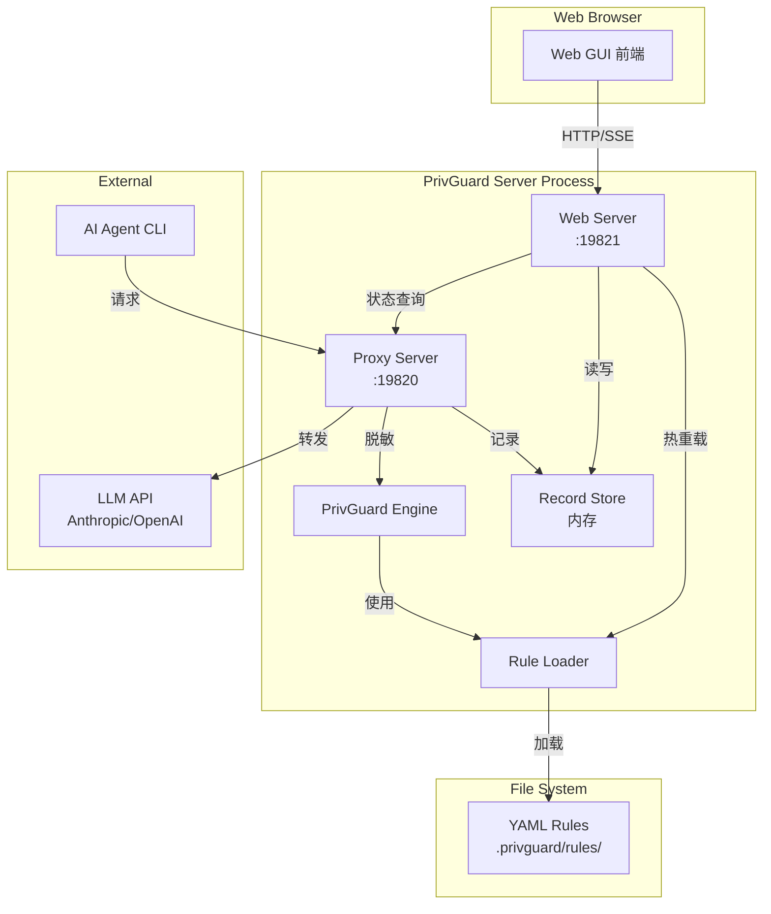

# PrivGuard Web GUI 技术设计文档

## Overview

PrivGuard Web GUI 是一个轻量级的 Web 管理界面，用于可视化管理 PrivGuard 隐私保护引擎。该界面与现有的代理服务器（Proxy Server）集成，提供拦截记录查看、规则管理和实时状态监控功能。

### 设计目标

1. **轻量级**: 不引入重型前端框架，使用原生 HTML/CSS/JS
2. **零外部依赖**: 延续 PrivGuard 引擎的设计理念，Web 服务器使用 Node.js 内置模块
3. **实时性**: 拦截记录实时更新，规则修改即时生效
4. **安全性**: 基于密码的简单认证，保护敏感的拦截记录

### 核心功能

- 用户认证（密码登录 + Session 管理）
- 拦截记录查看（实时更新、筛选、分页）
- 保护规则管理（查看、编辑、测试）
- 代理服务器状态监控
- 规则热重载

## Architecture

### 高层架构图



### 进程模型

Web GUI 采用**单进程双服务**模型：

```
┌─────────────────────────────────────────────────────────┐
│                   PrivGuard Process                      │
│                                                          │
│  ┌──────────────────┐    ┌──────────────────┐           │
│  │   Web Server     │    │   Proxy Server   │           │
│  │   Port: 19821    │    │   Port: 19820    │           │
│  │                  │    │                  │           │
│  │  - 静态文件服务   │    │  - 请求拦截      │           │
│  │  - REST API      │    │  - PII 脱敏      │           │
│  │  - SSE 推送      │    │  - 响应还原      │           │
│  └────────┬─────────┘    └────────┬─────────┘           │
│           │                       │                      │
│           └───────────┬───────────┘                      │
│                       │                                  │
│              ┌────────▼────────┐                         │
│              │  Shared State   │                         │
│              │  - Engine       │                         │
│              │  - Records[]    │                         │
│              │  - Rules[]      │                         │
│              └─────────────────┘                         │
└─────────────────────────────────────────────────────────┘
```

### 目录结构

```
PrivGuardEngine/engine/src/
├── cli.ts                    # CLI 入口（已有）
├── engine.ts                 # 核心引擎（已有）
├── loader.ts                 # 规则加载器（已有）
├── registry.ts               # 映射注册表（已有）
├── proxy/
│   ├── server.ts             # 代理服务器（已有）
│   ├── adapters.ts           # API 适配器（已有）
│   └── display.ts            # 终端显示（已有）
└── gui/                      # 新增：Web GUI 模块
    ├── web-server.ts         # HTTP 服务器
    ├── auth.ts               # 认证模块
    ├── api.ts                # REST API 路由
    ├── sse.ts                # SSE 实时推送
    ├── record-store.ts       # 拦截记录存储
    └── static/               # 前端静态文件
        ├── index.html        # 主页面
        ├── login.html        # 登录页面
        ├── style.css         # 样式
        └── app.js            # 前端逻辑
```

## Components and Interfaces

### 1. Web Server 组件 (`gui/web-server.ts`)

HTTP 服务器，处理静态文件、REST API 和 SSE 连接。

```typescript
interface WebServerConfig {
  port: number;
  password: string;
  proxyServer?: ProxyServerHandle;
  rulesDir: string;
}

interface WebServerHandle {
  stop: () => void;
  getPort: () => number;
}

// 启动 Web 服务器
function startWebServer(config: WebServerConfig): WebServerHandle;
```

### 2. 认证模块 (`gui/auth.ts`)

简单的密码认证和 Session 管理。

```typescript
interface Session {
  id: string;
  createdAt: number;
  lastActivity: number;
}

interface AuthModule {
  // 验证密码
  validatePassword(input: string): boolean;
  
  // 创建 Session
  createSession(): Session;
  
  // 验证 Session
  validateSession(sessionId: string): boolean;
  
  // 更新活动时间
  touchSession(sessionId: string): void;
  
  // 注销 Session
  destroySession(sessionId: string): void;
  
  // 清理过期 Session
  cleanupExpiredSessions(): void;
}

// Session 配置
const SESSION_MAX_AGE = 24 * 60 * 60 * 1000; // 24 小时
const SESSION_COOKIE_NAME = 'privguard_session';
```

### 3. REST API 路由 (`gui/api.ts`)

```typescript
// API 端点定义
interface ApiRoutes {
  // 认证
  'POST /api/login': (body: { password: string }) => { success: boolean; error?: string };
  'POST /api/logout': () => { success: boolean };
  
  // 拦截记录
  'GET /api/records': (query: RecordQuery) => { records: InterceptRecord[]; total: number };
  'GET /api/records/:id': (id: string) => InterceptRecord;
  
  // 规则管理
  'GET /api/rules': () => { system: Rule[]; custom: Rule[] };
  'POST /api/rules/custom': (body: Rule) => { success: boolean; error?: string };
  'PUT /api/rules/custom/:index': (index: number, body: Rule) => { success: boolean; error?: string };
  'DELETE /api/rules/custom/:index': (index: number) => { success: boolean };
  'POST /api/rules/test': (body: { pattern: string; text: string }) => { matches: string[] };
  'POST /api/rules/reload': () => { success: boolean; count: number };
  
  // 代理状态
  'GET /api/proxy/status': () => ProxyStatus;
  'POST /api/proxy/start': () => { success: boolean };
}

interface RecordQuery {
  page?: number;        // 默认 1
  pageSize?: number;    // 默认 50，最大 100
  type?: string;        // PII 类型筛选
  startTime?: number;   // 时间范围开始
  endTime?: number;     // 时间范围结束
}

interface ProxyStatus {
  running: boolean;
  port?: number;
  upstreamUrl?: string;
  requestCount: number;
  lastActivity?: number;
}
```

### 4. 拦截记录存储 (`gui/record-store.ts`)

内存中的拦截记录存储，支持查询和实时推送。

```typescript
interface InterceptRecord {
  id: string;                    // UUID
  timestamp: number;             // Unix 时间戳
  direction: 'request' | 'response';
  apiFormat: 'anthropic' | 'openai' | 'unknown';
  
  // 检测信息
  detectedCount: number;
  sanitizedCount: number;
  piiTypes: string[];
  
  // 详细信息（展开时显示）
  items: Array<{
    type: string;
    masked: string;              // 掩码值，如 "138****5678"
    placeholder: string;
  }>;
  
  // 原始/脱敏文本对比（可选，用于详情展示）
  originalPreview?: string;      // 截断的原始文本
  sanitizedPreview?: string;     // 截断的脱敏文本
}

interface RecordStore {
  // 添加记录
  add(record: InterceptRecord): void;
  
  // 查询记录
  query(options: RecordQuery): { records: InterceptRecord[]; total: number };
  
  // 获取单条记录
  get(id: string): InterceptRecord | undefined;
  
  // 订阅新记录（用于 SSE）
  subscribe(callback: (record: InterceptRecord) => void): () => void;
  
  // 清理旧记录（保留最近 1000 条）
  cleanup(): void;
}

const MAX_RECORDS = 1000;
const PREVIEW_MAX_LENGTH = 200;
```

### 5. SSE 实时推送 (`gui/sse.ts`)

Server-Sent Events 实现，用于实时推送新的拦截记录。

```typescript
interface SSEConnection {
  id: string;
  response: ServerResponse;
  lastEventId: number;
}

interface SSEManager {
  // 添加连接
  addConnection(res: ServerResponse): string;
  
  // 移除连接
  removeConnection(id: string): void;
  
  // 广播事件
  broadcast(event: string, data: any): void;
  
  // 发送心跳
  sendHeartbeat(): void;
}

// SSE 事件类型
type SSEEventType = 
  | 'record'           // 新拦截记录
  | 'rule-change'      // 规则变更
  | 'proxy-status'     // 代理状态变化
  | 'heartbeat';       // 心跳
```

### 6. 规则管理集成

扩展现有的 `loader.ts`，支持规则的写入和热重载。

```typescript
// 新增接口
interface RuleManager {
  // 加载所有规则
  loadAll(rulesDir: string): { system: Rule[]; custom: Rule[] };
  
  // 保存自定义规则
  saveCustomRules(rulesDir: string, rules: Rule[]): void;
  
  // 验证正则表达式
  validatePattern(pattern: string): { valid: boolean; error?: string };
  
  // 测试规则匹配
  testRule(pattern: string, text: string): string[];
  
  // 热重载回调
  onReload?: (rules: Rule[]) => void;
}
```

## Data Models

### 前端状态模型

```typescript
interface AppState {
  // 认证状态
  authenticated: boolean;
  
  // 拦截记录
  records: InterceptRecord[];
  recordsTotal: number;
  recordsPage: number;
  recordsFilter: {
    type?: string;
    startTime?: number;
    endTime?: number;
  };
  
  // 规则
  systemRules: Rule[];
  customRules: Rule[];
  editingRule?: Rule & { index?: number };
  
  // 代理状态
  proxyStatus: ProxyStatus;
  
  // UI 状态
  expandedRecordId?: string;
  ruleTestResult?: string[];
}
```

### 规则变更历史

```typescript
interface RuleChangeLog {
  timestamp: number;
  action: 'add' | 'update' | 'delete';
  ruleName: string;
  ruleType: string;
}

// 存储在内存中，最多保留 100 条
const MAX_CHANGE_LOGS = 100;
```


## Correctness Properties

*A property is a characteristic or behavior that should hold true across all valid executions of a system—essentially, a formal statement about what the system should do. Properties serve as the bridge between human-readable specifications and machine-verifiable correctness guarantees.*

### Property 1: 端口配置正确性

*For any* 有效端口号 (1024-65535)，当使用 `--port` 参数启动 Web GUI 时，服务应该在该指定端口监听。

**Validates: Requirements 1.2**

### Property 2: 启动输出包含访问地址

*For any* 启动配置（端口号），Web GUI 启动时输出的文本应该包含格式正确的访问 URL（`http://localhost:{port}`）。

**Validates: Requirements 1.4**

### Property 3: 未认证请求重定向

*For any* 未携带有效 Session 的 HTTP 请求（访问非登录页面的路径），Web GUI 应该返回重定向到登录页面或 401 状态码。

**Validates: Requirements 2.1**

### Property 4: 认证往返正确性

*For any* 密码字符串，如果使用该密码配置 Web GUI，然后使用相同密码登录，应该成功创建 Session；使用该 Session 访问 API 应该被允许。

**Validates: Requirements 2.3, 2.4, 2.6**

### Property 5: 错误密码拒绝

*For any* 与配置密码不同的字符串，使用该字符串尝试登录应该失败，不创建 Session。

**Validates: Requirements 2.5**

### Property 6: Session 过期

*For any* Session，如果最后活动时间超过 24 小时，该 Session 应该被视为无效，使用它访问 API 应该被拒绝。

**Validates: Requirements 2.7**

### Property 7: 拦截记录包含必需字段

*For any* 拦截记录，其序列化表示应该包含：id、timestamp、direction、detectedCount、piiTypes。

**Validates: Requirements 3.1**

### Property 8: 记录查询排序正确性

*For any* 拦截记录集合，查询返回的结果应该按 timestamp 降序排列（最新在前）。

**Validates: Requirements 3.3**

### Property 9: 记录分页正确性

*For any* 拦截记录集合和分页参数（page, pageSize），返回的记录数量应该不超过 pageSize，且 total 应该等于符合筛选条件的总记录数。

**Validates: Requirements 3.4**

### Property 10: 记录类型筛选正确性

*For any* PII 类型筛选条件，返回的所有记录的 piiTypes 数组应该包含该筛选类型。

**Validates: Requirements 3.5**

### Property 11: 记录时间筛选正确性

*For any* 时间范围筛选条件 (startTime, endTime)，返回的所有记录的 timestamp 应该在该范围内。

**Validates: Requirements 3.6**

### Property 12: 敏感值掩码

*For any* 长度大于 4 的敏感值字符串，掩码后的结果应该包含 "****" 且长度小于原始值。

**Validates: Requirements 3.8**

### Property 13: 正则表达式验证

*For any* 字符串，正则验证函数应该正确判断其是否为有效的 JavaScript 正则表达式语法。

**Validates: Requirements 4.4**

### Property 14: 规则持久化往返

*For any* 有效的自定义规则，保存到 custom.yml 后重新加载，应该得到等价的规则对象。

**Validates: Requirements 4.6**

### Property 15: 规则删除正确性

*For any* 自定义规则列表和要删除的规则索引，删除操作后该规则应该不再存在于列表中，其他规则保持不变。

**Validates: Requirements 4.8**

### Property 16: 规则测试匹配正确性

*For any* 有效正则表达式和测试文本，规则测试函数返回的匹配结果应该与直接使用 RegExp 匹配的结果一致。

**Validates: Requirements 4.9**

### Property 17: 规则变更历史记录

*For any* 规则变更操作（添加、更新、删除），变更历史应该包含该操作的记录（时间戳、操作类型、规则名称）。

**Validates: Requirements 5.5**

### Property 18: 规则配置共享

*For any* 时刻，Web GUI 和 Proxy Server 使用的规则集合应该相同（指向同一内存引用或从同一文件加载）。

**Validates: Requirements 6.5**

## Error Handling

### 1. 服务启动错误

| 错误场景 | 处理方式 |
|---------|---------|
| 端口被占用 | 显示错误信息，提示使用 `--port` 指定其他端口 |
| 规则目录不存在 | 显示警告，使用空规则集启动 |
| 规则文件解析失败 | 显示警告，跳过无效规则文件 |

### 2. 认证错误

| 错误场景 | HTTP 状态码 | 响应 |
|---------|------------|------|
| 密码错误 | 401 | `{ "error": "Invalid password" }` |
| Session 无效/过期 | 401 | `{ "error": "Session expired" }` |
| 缺少 Session | 401 | 重定向到登录页面 |

### 3. API 错误

| 错误场景 | HTTP 状态码 | 响应 |
|---------|------------|------|
| 无效的正则表达式 | 400 | `{ "error": "Invalid regex pattern", "detail": "..." }` |
| 规则索引越界 | 404 | `{ "error": "Rule not found" }` |
| 规则文件写入失败 | 500 | `{ "error": "Failed to save rules", "detail": "..." }` |
| 记录 ID 不存在 | 404 | `{ "error": "Record not found" }` |

### 4. 热重载错误

当规则热重载失败时：
1. 保持使用旧规则
2. 通过 SSE 推送错误事件到前端
3. 在 Web GUI 显示错误提示
4. 记录错误到控制台

```typescript
interface ReloadError {
  timestamp: number;
  message: string;
  file?: string;
}
```

### 5. SSE 连接错误

| 错误场景 | 处理方式 |
|---------|---------|
| 连接断开 | 前端自动重连（指数退避，最大 30 秒） |
| 心跳超时 | 前端主动断开并重连 |
| 服务器关闭 | 前端显示连接断开提示 |

## Testing Strategy

### 单元测试

使用 Node.js 内置的 `node:test` 模块，无需额外依赖。

**测试范围：**

1. **认证模块** (`auth.test.ts`)
   - 密码验证
   - Session 创建/验证/销毁
   - Session 过期清理

2. **记录存储** (`record-store.test.ts`)
   - 记录添加
   - 查询（分页、筛选、排序）
   - 最大记录数限制

3. **规则管理** (`rule-manager.test.ts`)
   - 正则验证
   - 规则测试
   - YAML 序列化/反序列化

4. **工具函数** (`utils.test.ts`)
   - 值掩码
   - URL 解析
   - 时间格式化

### 属性测试

使用 `fast-check` 库进行属性测试，每个属性测试运行至少 100 次迭代。

```typescript
// 示例：Property 4 - 认证往返正确性
// Feature: privguard-web-gui, Property 4: 认证往返正确性
test('authentication round-trip', () => {
  fc.assert(
    fc.property(fc.string({ minLength: 1 }), (password) => {
      const auth = createAuthModule(password);
      const session = auth.createSession();
      
      // 正确密码应该验证通过
      expect(auth.validatePassword(password)).toBe(true);
      // Session 应该有效
      expect(auth.validateSession(session.id)).toBe(true);
    }),
    { numRuns: 100 }
  );
});

// 示例：Property 8 - 记录查询排序正确性
// Feature: privguard-web-gui, Property 8: 记录查询排序正确性
test('records are sorted by timestamp descending', () => {
  fc.assert(
    fc.property(
      fc.array(fc.record({
        id: fc.uuid(),
        timestamp: fc.integer({ min: 0 }),
        direction: fc.constantFrom('request', 'response'),
        detectedCount: fc.integer({ min: 0 }),
        piiTypes: fc.array(fc.string()),
      })),
      (records) => {
        const store = createRecordStore();
        records.forEach(r => store.add(r));
        
        const result = store.query({});
        for (let i = 1; i < result.records.length; i++) {
          expect(result.records[i - 1].timestamp)
            .toBeGreaterThanOrEqual(result.records[i].timestamp);
        }
      }
    ),
    { numRuns: 100 }
  );
});

// 示例：Property 14 - 规则持久化往返
// Feature: privguard-web-gui, Property 14: 规则持久化往返
test('rule persistence round-trip', () => {
  fc.assert(
    fc.property(
      fc.record({
        type: fc.string({ minLength: 1 }).map(s => s.toUpperCase().replace(/\s/g, '_')),
        name: fc.string({ minLength: 1 }),
        pattern: fc.constant('\\d+'), // 使用固定有效正则避免无效模式
        confidence: fc.constantFrom('high', 'medium', 'low'),
      }),
      (rule) => {
        const yaml = serializeRuleToYaml(rule);
        const parsed = parseRuleFromYaml(yaml);
        
        expect(parsed.type).toBe(rule.type);
        expect(parsed.name).toBe(rule.name);
        expect(parsed.pattern).toBe(rule.pattern);
        expect(parsed.confidence).toBe(rule.confidence);
      }
    ),
    { numRuns: 100 }
  );
});
```

### 集成测试

**测试范围：**

1. **HTTP API 测试**
   - 完整的登录流程
   - API 端点响应
   - 错误处理

2. **SSE 测试**
   - 连接建立
   - 事件推送
   - 重连机制

3. **热重载测试**
   - 规则修改后生效
   - 错误恢复

### 测试命令

```bash
# 单元测试
npm test

# 属性测试
npm run test:property

# 集成测试
npm run test:integration

# 全部测试
npm run test:all
```
